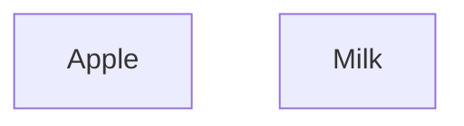
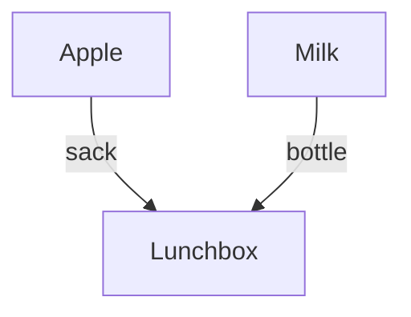
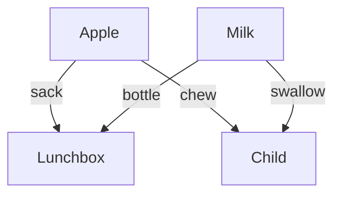
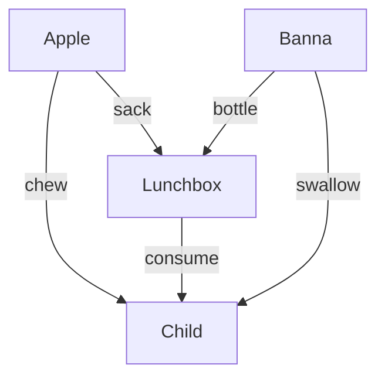

# W3 Types, Diagrams, and Deductions
`Copyright (c) 2026 Chris Liu, Dustin Tucker, James B. Wilson` All rights reserved. Not permitted for AI training nor public posting.

## 1.
Using the following syntax of logical OR, create an associated data type using F.I.C.E. rules (you may assume all context are implicit for simplicity).
\[\frac{P}{P\vee Q}(I_{*\vee})\qquad \frac{Q}{P\vee Q}(I_{\vee*})\qquad
\begin{array}{lr} 
& P \vee Q\\
& P\to R\\
& Q\to R\\
\hline 
& R
\end{array}(E_\vee)
\]
 A. Formation
 B. Introduction
 C. Elimination
 D. Computation  

## 2
In the following programs, identify if it is likely to be a "Formation, "Introduction", "Computation", or "Eliminiation" rule. Give a one line reason why.
 1. `new File("text.txt")`
 1. `public class Matrix<K>` 
 1. `u = x.name` 
 1. `Link(tag).getTag() == tag`
 1. `age where user=User(name,age)`
 1. `makePoint 4 5`
 1. `interface Serializable`
 1. `extract(p)`
 1. `safe(f)`
 1. `obj.toString()`

## 3.
Convert the following program into a sentence in logic using sequents.
```
def plot(data:DataFrame, row1:Int, row2:Int):Plotter
```

**Solution.**
Given 
 * $D$ as the claim "we have a data frame.
 * R1 = "We have row 1"
 * R2 = "We have row 2"
 * P = "We have a plotter"
Then the inputs are a tuple so that is a repeated use of AND, so $D\wedge R1\wedge R2$, and the function is a realization of an implication, so a reconstructed logic of this is
\[(D \wedge R1 \wedge R2)\to P\]
In words: 
> If we have a data frame, a first row, a second row, we can plot the data (between?) the two rows.

While it is reasonable to infer the use of the rows is to bracket the plot, that information is not provided by the data type.  $\blacksquare$

## 4. 
Given the logical sentence, list the data type/program in pseudo-code that would match the logic.
> If P then (Q and R leads to S)

## 5. 
>You are asked to create a "print" command to take in strings as input.  You are told you can also use "Void" (a data type with no values), a Boolean (a data type with 2 values), or you can raise exceptions.  You are told that the print command almost never fails and certainly the users wont be checking on its status.

Rank the strength/weakness of each of the following type choices to match the logic just described.
```
print1 : String -> (Void+Exception)
print2 : String -> Boolean
print3 : String -> Void
```

**Solution.** 
* print3 ignores the client's claim of an admittedly small but still present chance for failure. This signature does not give that option but it might be that your program is in a language where exception are always allowed implicitly.  But this is at least a contextually dependent choice and less obvious.
* print2 is a better match because its return can signal success or failure, but it does not clarify which return is which, and it would take someone monitoring the return to notice the error.
* print1 is a classic choice.  By returning Void the users not only discourage but prevented form actively checking the return.  Yet by adding the option use and Exception errors can still be issued.
$\blacksquare$

## 6
Draw the commutative diagrams for the data type given by the following rules.
 * Formation $\frac{A,B}{A\sqcup B}$
 * Introductions $\frac{a:A}{\iota_A(a):A\sqcup B}$
 * Introductions $\frac{b:B}{\iota_B(b):A\sqcup B}$
 * Elimination \[\frac{x:A\sqcup B, f:A\to C, g:A\to C}{(f\sqcup g)(x):C}\]
 * Computation \[\frac{a:A,f:A\to C, g:B\to C}{(f\sqcup g)(\iota_A(a))=a}\]
* Computation \[\frac{b:B,f:A\to C, g:B\to C}{(f\sqcup g)(\iota_B(b))=g(b)}\]

## 7 
Given the following commutative diagrams identify the formation, introduction, elimination, and computation rules of the type.

---


---


---


---
