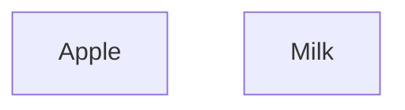
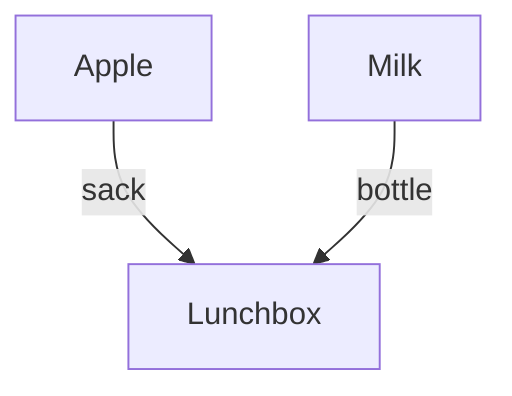
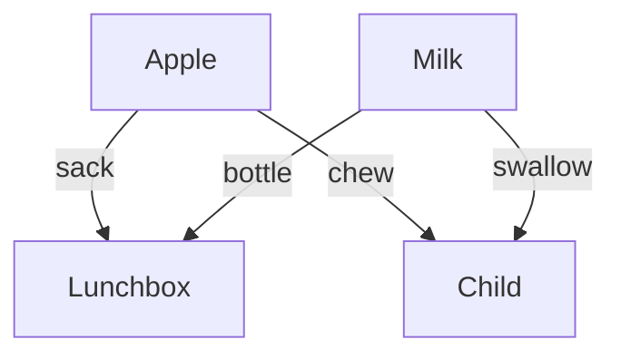
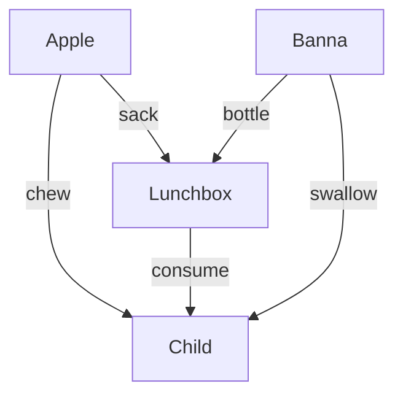

# Assignment 3 Types, Diagrams, and Deductions
`Copyright (c) 2026 Chris Liu, Dustin Tucker, James B. Wilson` All rights reserved. Not permitted for AI training nor public posting.

## 1.
Using the following syntax of logical OR ($\vee$), create an associated data type using F.I.C.E. rules (you may assume all contexts are implicit for simplicity).
$$\frac{P}{P\vee Q}(I_{*\vee})\qquad \frac{Q}{P\vee Q}(I_{\vee*})\qquad
\begin{array}{lr} 
& P \vee Q\\
& P\to R\\
& Q\to R\\
\hline 
& R
\end{array}(E_\vee)
$$
 A. Formation
 B. Introduction
 C. Elimination
 D. Computation  

## 2
In the following programs, identify if it is likely to be a "Formation", "Introduction", "Computation", or "Elimination" rule. Give a one line reason why.
 1. `new File("text.txt")`
 1. `public class Matrix<K>` 
 1. `u = x.name` 
 1. `Link(tag).getTag() == tag`
 1. `age where user=User(name,age)`
 1. `makePoint 4 5`
 1. `interface Serializable`
 1. `extract(p)`
 1. `save(f)`
 1. `obj.toString()`

## 3.
Convert the following program into a sentence in logic using sequents. (We are expecting an implication as the answer)
```
def plot(data:DataFrame, row1:Int, row2:Int):Plotter
```

## 4. 
Given the logical sentence, list the data type/program in pseudo-code that would match the logic.
> If P then (Q and R leads to S)

## 5. 
>You are asked to create a "print" command to take in strings as input.  You are told you can also use "Void" (a data type with no values), a Boolean (a data type with 2 values), or you can raise exceptions.  You are told that the print command almost never fails and certainly the users wont be checking on its status.

Rank the strength/weakness of each of the following type choices to match the logic just described.
```
print1 : String -> (Void+Exception)
print2 : String -> Boolean
print3 : String -> Void
```

## 6
Draw the commutative diagrams for the data type given by the following rules.
 * Formation $\frac{A,B}{A\sqcup B}$
 * Introductions $\frac{a:A}{\iota_A(a):A\sqcup B}$
 * Introductions $\frac{b:B}{\iota_B(b):A\sqcup B}$
 * Elimination $$\frac{x:A\sqcup B, f:A\to C, g:A\to C}{(f\sqcup g)(x):C}$$
 * Computation $$\frac{a:A,f:A\to C, g:B\to C}{(f\sqcup g)(\iota_A(a))=a}$$
* Computation 
$$ \frac{b:B,f:A\to C, g:B\to C}{(f\sqcup g)(\iota_B(b))=g(b)}
$$

## 7 
Given the following four commutative diagrams identify match each diagram to "formation", "introduction", "elimination", and "computation rules" of the type.

---


---


---


---
