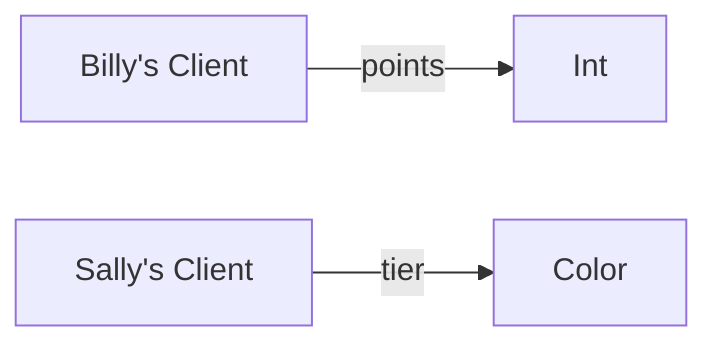
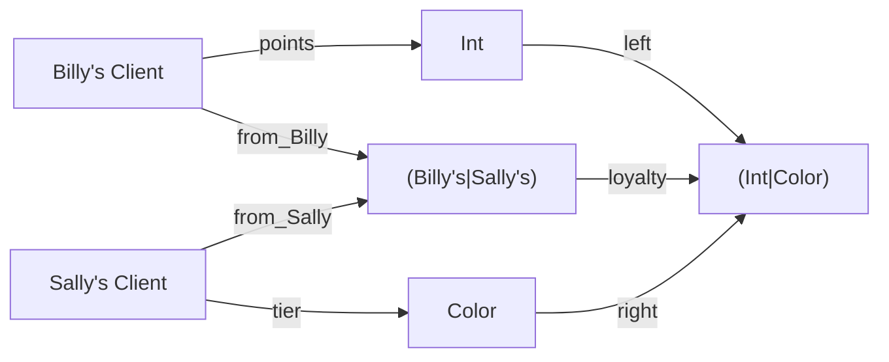

# Lab 3: Types

Your software team has been hard at work making code to support Bill and Sally's big store merger.  The engineering team presents their design and needs you to review it and ok the logic with the client.


---

## 1. Engineering progress report

Eugene the engineer tells us the following function fetchs points from clients at Billy's Bats-&-Balls, and also one for Sally's Shoes-&-Socks.
```scala
def points(client:BillyClient):Int
def tier(client:SallyClient):Color

```

> 1. Write the possible logic of this function using $A\overset{f}{\longrightarrow} B$ notation (like a flowchart) and then in words.


 * Billy's clients lead to integer points.
 * Sally's client lead to color tiers.

--- 

## 2. Engineering proposal

The engineering team suggests this interface for joining the two loyalty programs.
```scala
def loyalty(client:(BillyClient | SallyClient )) : (Int | Color)
```
Realizing everyone is scared of this code he quickly says `(A|B)` just means "data from A or B".

> 2 Starting from the input, draw a commutative diagram (flow chart) of the information in and out.  Remember the logic of OR tells you the introductions (constructor/"setters") and elimination rules "getter(s)" you should exepct.  [Here is a start.]



---

## 3. Filling in the missing pieces.

> 3. In the syntax given, write the signatures of the functions which are missing from the engineering proposal. [Here is a start]
```scala
def left(x:Int) : (Int | Color) = x
def right(c:Color) : (Int | Color) = y
def from_Billy( c:SallyClient) : (BillyClient | SallyClient) = c
def from_Sally( c:SallyClient) : (BillyClient | SallyClient) = c
``` 

> 4. Write a test you can do of this design that leverages the fact that composing two paths should be equal ("commutative diagram").


`right(tier(sally_client)) == loyalty(from_Sally(sally_client))`
`left(points(billy_client)) == loyalty(from_Billy(billy_client))`

---

## 4. Revamp.

> 5. With this interface can a customer form Billy's use loyatly at Sally's?  Explain why not.

Not with the functions so far given because all we are guaranteed is that Billy's loyalty returns points, but those we have no idea how to convert into Sally's tiers.

Realizing there are gaps, Eugene remarks there is a data type `(A,B)` which means "a pair of data from $A$ and $B$".

> 6. Redesign your program so that `loyalty` outputs `(Int,Color)` where a client from a different store is automatically given a comparable value to the other store via: 5 pts = Blue, 10 = Red.  Left over points are kept.


---

## 5. A demo.

```scala

class BillyClient(points: Int) 
def points(client: BillyClient) : Int = client.points

type Color = Blue | Red
class SallyClient(color: Color)
def tier(client: SallyClient) : Color = client.color

def loyalty( client : BillyClient | SallyClient ) : (Int,Color) = 
    client match
        BillyClient => {
            p = points(client) 
            if p > 5 
                (p, Red ) 
            else 
                (p, Blue )
        }
        SallyClient => {
            c = tier(client)
            if c == Blue 
                (5,c)
            else
                (10,c)
        }

val bclient = BillyClient(8)
val sclient = SallyClient(Red)
val l1 = loyalty(bclient)
val l2 = loyalty(sclient)
println(l1) // (8,Red)
println(l2) // (10,Red) 
```