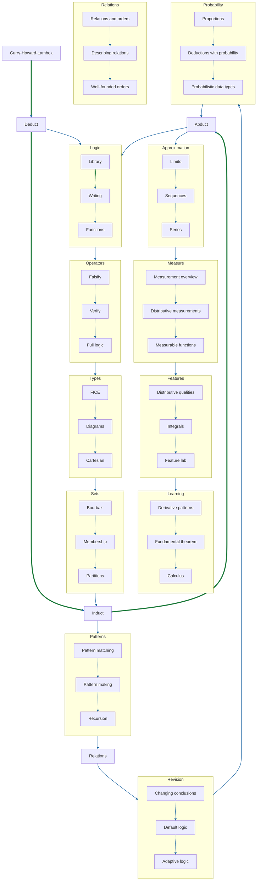

```mermaid
flowchart TD
  %% Declare a readable Mermaid node, then link it to its project-root QMD.
  Preface["Curry-Howard-Lambek"]
  click Preface "00/preface.qmd" "Open Preface"
  Deduct["Deduct"]
  click Deduct "Deduct/index.qmd" "Open Deduct"
  Induct["Induct"]
  click Induct "Induct/index.qmd" "Open Induct"
  Abduct["Abduct"]
  click Abduct "Abduct/index.qmd" "Open Abduct"

  %% Thick green Survey circuit.
  Preface ==> Deduct
  Deduct ==> Induct
  Induct ==> Abduct

    subgraph Logic["Logic"]
      direction TB      

      Library["Library"]
      click Library "Deduct/01/01-Logic-Library.qmd" "Open Library"
      Writing["Writing"]
      click Writing "Deduct/01/02-Writing-down-a-logic.qmd" "Open Writing"
      Functions["Functions"]
      click Functions "Deduct/01/03-Sub-Var-Func.qmd" "Open Functions"

      Library -.-> Writing
      Writing -.-> Functions
    end
    click Logic "Deduct/01/index.qmd" "Open Logic"

  Abduct ==> Logic

    subgraph Operators["Operators"]
      direction TB

      Falsify["Falsify"]
      click Falsify "Deduct/02/01-Falsify-Elim.qmd" "Open Falsification"
      Verify["Verify"]
      click Verify "Deduct/02/02-Verify-Intro.qmd" "Open Verification"
      Full["Full logic"]
      click Full "Deduct/02/03-Full-Logic.qmd" "Open Full Logic"

      Falsify -.-> Verify
      Verify -.-> Full
    end
    click Operators "Deduct/02/index.qmd" "Open Operators"


    subgraph Types["Types"]
      direction TB

      FICE["FICE"]
      click FICE "Deduct/03/MakingTypes.qmd" "Open Types"
      Diagrams["Diagrams"]
      click Diagrams "Deduct/03/equations-from-flow-charts.qmd" "Open Diagrams"
      Cartessian["Cartesian"]
      click Cartessian "Deduct/03/sets-types-and-other-higher-order-logic.qmd" "Open Cartessian"

      FICE -.-> Diagrams
      Diagrams -.-> Cartessian
    end
    click Types "Deduct/03/index.qmd" "Open Types"

    subgraph Sets["Sets"]
      direction TB

      Bourbaki["Bourbaki"]
      click Bourbaki "Deduct/04/1-Boubaki-Functions.qmd" "Open Bourbaki"
      Membership["Membership"]
      click Membership "Deduct/04/what-is-a-subset.qmd" "Open Membership"
      Partitions["Partitions"]
      click Partitions "Deduct/04/partitions.qmd" "Open Partitions"

      Bourbaki -.-> Membership
      Membership -.-> Partitions
    end
    click Sets "Deduct/04/index.qmd" "Open Sets"

    %% Thin blue, higher-resistance detail paths.
    Deduct --> Logic
    Logic --> Operators
    Operators --> Types
    Types --> Sets
    Sets --> Induct


    subgraph Patterns["Patterns"]
      direction TB
      PatternMatching["Pattern matching"]
      click PatternMatching "Induct/05/Pattern-Matching.qmd" "Open Pattern Matching"
      PatternMaking["Pattern making"]
      click PatternMaking "Induct/05/pattern-making-and-its-co-operators.qmd" "Open Pattern Making"
      Recursion["Recursion"]
      click Recursion "Induct/05/recursion-and-fixed-points.qmd" "Open Recursion"

      PatternMatching -.-> PatternMaking
      PatternMaking -.-> Recursion
    end
    click Patterns "Induct/05/index.qmd" "Open Patterns"

    subgraph RelationsPath["Relations"]
      direction TB
      RelationsOrders["Relations and orders"]
      click RelationsOrders "Induct/06/relations-and-orders.qmd" "Open Relations and Orders"
      DescribingRelations["Describing relations"]
      click DescribingRelations "Induct/06/describing-relations.qmd" "Open Describing Relations"
      WellFounded["Well-founded orders"]
      click WellFounded "Induct/06/minimums-maximums-and-well-founded-orders.qmd" "Open Well-founded Orders"

      RelationsOrders -.-> DescribingRelations
      DescribingRelations -.-> WellFounded
    end
    click Relations "Induct/06/index.qmd" "Open Relations"

    subgraph Revision["Revision"]
      direction TB
      ChangingConclusions["Changing conclusions"]
      click ChangingConclusions "Induct/07/Changing-your-answers.qmd" "Open Changing Conclusions"
      DefaultLogic["Default logic"]
      click DefaultLogic "Induct/07/using-default-logic.qmd" "Open Default Logic"
      AdaptiveLogic["Adaptive logic"]
      click AdaptiveLogic "Induct/07/using-adaptive-logic.qmd" "Open Adaptive Logic"

      ChangingConclusions -.-> DefaultLogic
      DefaultLogic -.-> AdaptiveLogic
    end
    click Revision "Induct/07/index.qmd" "Open Revision"

    subgraph Probability["Probability"]
      direction TB
      Proportions["Proportions"]
      click Proportions "Induct/08/proportions-towards-probability.qmd" "Open Proportions"
      ProbabilityDeductions["Deductions with probability"]
      click ProbabilityDeductions "Induct/08/deductions-with-probabilities.qmd" "Open Deductions with Probability"
      ProbabilisticTypes["Probabilistic data types"]
      click ProbabilisticTypes "Induct/08/probabilistic-data-types.qmd" "Open Probabilistic Data Types"

      Proportions -.-> ProbabilityDeductions
      ProbabilityDeductions -.-> ProbabilisticTypes
    end
    click Probability "Induct/08/index.qmd" "Open Probability"

    Induct --> Patterns
    Patterns --> Relations
    Relations --> Revision
    Revision --> Probability
    Probability --> Abduct

    subgraph Approximation["Approximation"]
      direction TB
      Limits["Limits"]
      click Limits "Abduct/09/limits.qmd" "Open Limits"
      Sequences["Sequences"]
      click Sequences "Abduct/09/sequences.qmd" "Open Sequences"
      Series["Series"]
      click Series "Abduct/09/series.qmd" "Open Series"

      Limits -.-> Sequences
      Sequences -.-> Series
    end
    click Approximation "Abduct/09/index.qmd" "Open Approximation"

    subgraph Measure["Measure"]
      direction TB
      MeasurementOverview["Measurement overview"]
      click MeasurementOverview "Abduct/10/measurement-overview.qmd" "Open Measurement Overview"
      DistributiveMeasurements["Distributive measurements"]
      click DistributiveMeasurements "Abduct/10/part-1-dot-a-20mins-distributive-measurements.qmd" "Open Distributive Measurements"
      MeasurableFunctions["Measurable functions"]
      click MeasurableFunctions "Abduct/10/12-dot-1-b-20mins-measurable-functions.qmd" "Open Measurable Functions"

      MeasurementOverview -.-> DistributiveMeasurements
      DistributiveMeasurements -.-> MeasurableFunctions
    end
    click Measure "Abduct/10/index.qmd" "Open Measure"

    subgraph Features["Features"]
      direction TB
      DistributiveQualities["Distributive qualities"]
      click DistributiveQualities "Abduct/11/distributive-qualities.qmd" "Open Distributive Qualities"
      Integrals["Integrals"]
      click Integrals "Abduct/11/integrals.qmd" "Open Integrals"
      FeatureLab["Feature lab"]
      click FeatureLab "Abduct/11/lab-12-sales-volumes-of-a-distributor.qmd" "Open Feature Lab"

      DistributiveQualities -.-> Integrals
      Integrals -.-> FeatureLab
    end
    click Features "Abduct/11/index.qmd" "Open Features"

    subgraph Learning["Learning"]
      direction TB
      DerivativePatterns["Derivative patterns"]
      click DerivativePatterns "Abduct/12/derivative-patterns.qmd" "Open Derivative Patterns"
      FundamentalTheorem["Fundamental theorem"]
      click FundamentalTheorem "Abduct/12/fundamental-theorem-of-calculus.qmd" "Open Fundamental Theorem"
      Calculus["Calculus"]
      click Calculus "Abduct/12/part-3-calculus-with-sums-products-and-powers.qmd" "Open Calculus"

      DerivativePatterns -.-> FundamentalTheorem
      FundamentalTheorem -.-> Calculus
    end
    click Learning "Abduct/12/index.qmd" "Open Learning"

    Abduct --> Approximation
    Approximation --> Measure
    Measure --> Features
    Features --> Learning


  %% These styles affect Mermaid previews; the book uses its CSS parameters.
  %% Color parameters: green = Survey; blue = detail and detour paths.
  linkStyle default stroke:#2168a5,stroke-width:1.5px
  linkStyle 0,1,2,3 stroke:#1d7a3b,stroke-width:4px
```
