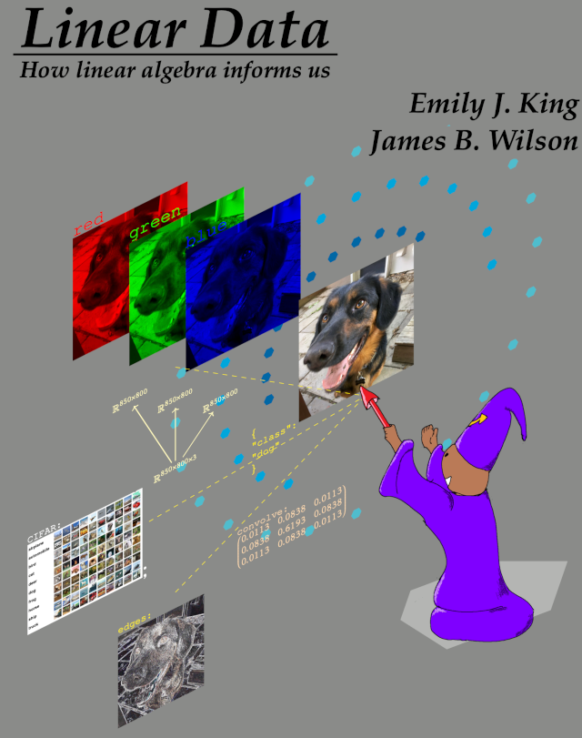

    

        

            <h1 class="uk-heading-medium">Call me James</h1>
            <!-- <h2 class="uk-heading-small uk-text-muted">Professor of Mathematics</h2> -->
            <!-- 
Colorado State University
 -->
            

            <h2> Theorem 1.  All the following are equivalent.
             Nilpotent $\Leftrightarrow$ Tensors $\Leftrightarrow$ Data science</h2>
            

            

             <Strong>Proof:</strong>  
                If $x^n=0$ then $x^n=x\times x\times\cdots$ means there's a product$(\times)$.
                Every zero $(0)$ needs a plus $(+)$. Times  with plus should distribute 
                $$a\times (b+c)=a\times b+a\times c.$$  
                Distributive multiplication is captured by a multiplication 
                table---what posh people call a tensor.
                What's the difference between a 
                Multiplication table and a Data table?
                Nothing really.
                $\Box$
            

        

    

    

        

            <a href="#" id="algeboy-youtube-btn" class="uk-button uk-button-primary uk-margin-small-right">
            @Algeboy on YouTube
            
            </a>

            <a href="/about/" class="uk-button uk-button-primary uk-margin-small-right">About Me</a>
            
            <a href="/contact/" class="uk-button uk-button-default uk-margin-small-right">
            Contact
            </a>

            <a href="/publications/" class="uk-button uk-button-default uk-margin-small-right">
            Articles
            </a>

            <a href="https://algeboy.github.io/LinearData/" class="uk-button uk-button-default">
            My <Strong>BOOK</strong> on Data Science Linear Algebra
            
            </a>
        

    

            

<H2> References </H2>

    

        

            <!-- Professional headshot placeholder -->
            

                
            

        

    

<!-- Projector Screen Overlay -->

    

        <button id="close-projector" class="close-projector-btn">✕</button>
        

        <iframe width="560" height="315" src="https://www.youtube.com/embed/D8Upe7RGL94?si=aJkRWnzEKZ-CkMNO" title="YouTube video player" frameborder="0" allow="accelerometer; autoplay; clipboard-write; encrypted-media; gyroscope; picture-in-picture; web-share" referrerpolicy="strict-origin-when-cross-origin" allowfullscreen>
        </iframe>
            </iframe>
        

    

